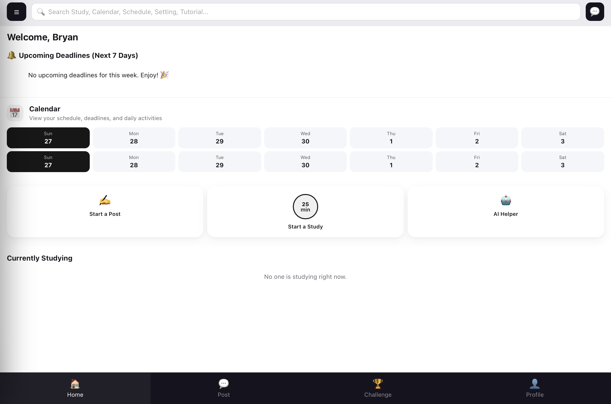
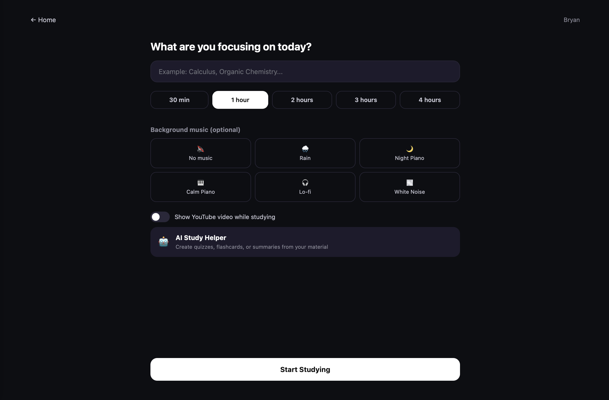

# ZenStudy

ZenStudy is a web application designed to help students manage their study routine and academic schedule in one place. It combines a calendar, task management, focus tools, and an AI-powered assistant to reduce the mental overhead of juggling deadlines, study sessions, and to-do lists.

> ⚠️ **Status:** ZenStudy is currently in active development. It is a working demo and is not yet deployed for public access. Features are still being added, refined, and tested.

## Table of Contents

- [Key Features](#key-features)
- [Tech Stack](#tech-stack)
- [Screenshots](#screenshots)
- [Installation](#installation)
- [Quick Start](#quick-start)
- [Problem & Solution](#problem--solution)
- [Project Status](#project-status)
- [Known Limitations](#known-limitations)
- [Future Improvements](#future-improvements)
- [Contributing](#contributing)
- [License](#license)

## Key Features

- **Calendar & Scheduling** – Plan and visualize study sessions and academic events
- **Study Timer** – Focused work sessions to support productive study habits
- **To-Do List** – Track assignments and daily tasks in one place
- **AI Helper** – AI-powered assistant to support planning and studying
- **Deadline Notifications** – Automatic reminders 7 days (H-7) before a deadline
- **Chat Feature** – Built-in chat functionality
- **Profile & Homepage** – Personalized user profile and homepage dashboard

## Tech Stack

**Frontend:** HTML, CSS, JavaScript
**Backend:** Python (Flask)

## Screenshots

**Homepage**


**Study Page**


## Installation

> ZenStudy does not yet have a hosted/live version. It must currently be run locally. A `requirements.txt` and setup script are planned; until then, use the manual steps below as a starting point and adjust based on the dependencies actually imported in the code.

### Prerequisites

- Python 3.x
- pip
- A modern web browser

### Setup

Clone the repository:

```bash
git clone https://github.com/bryant534/ZenStudy.git
cd ZenStudy
```

Create and activate a virtual environment (recommended):

```bash
python -m venv venv
source venv/bin/activate      # macOS/Linux
venv\Scripts\activate         # Windows
```

Install dependencies:

```bash
pip install flask
# add any additional packages the project imports (e.g. flask-sqlalchemy, python-dotenv, etc.)
```

## Quick Start

Run the Flask application:

```bash
python app.py
```

Then open your browser and go to:

```
http://localhost:8000
```

*(Adjust the entry-point filename and port above to match the actual app file if different.)*

## Problem & Solution

### The Problem

Students often rely on multiple disconnected tools to manage their academic life — a calendar app for scheduling, a separate to-do app for tasks, a timer app for focus sessions, and manual reminders for deadlines. Switching between these tools adds friction and makes it easy to lose track of upcoming work.

### The Solution

ZenStudy brings these needs into a single, focused workspace:

- One place to view schedules, tasks, and deadlines
- Built-in study timer to encourage focused work sessions
- Automatic H-7 deadline notifications so nothing is missed
- An AI helper to assist with planning and studying
- A simple, student-first interface instead of a generic productivity tool

**Result:** Less time spent managing tools, more time spent actually studying.

## Project Status

This is a second, from-scratch rebuild of an earlier ZenStudy prototype (previously in the `study projects` repository), redesigned to be more polished and interactive. The current version is under active development:

- Core features are functional in a local demo environment
- UI/UX is being refined
- General bug-checking and testing are ongoing
- Not yet deployed to a public/hosted domain

## Known Limitations

- Runs locally only — no hosted/live version yet
- Not yet open to external users
- Some planned features are still being built or refined
- Full test coverage and bug-checking are still in progress

## Future Improvements

- [ ] Deploy to a hosted domain for public access
- [ ] Add a `requirements.txt` for one-command dependency installation
- [ ] Expand and refine the AI Helper feature
- [ ] Add screenshots/demo video to this README
- [ ] Broader testing and bug fixes
- [ ] Polish UI/UX across all pages

## Contributing

This project is currently developed and maintained individually as part of ongoing personal/academic work. Suggestions and feedback are welcome via GitHub Issues.

## License

This project is licensed under the [MIT License](LICENSE).